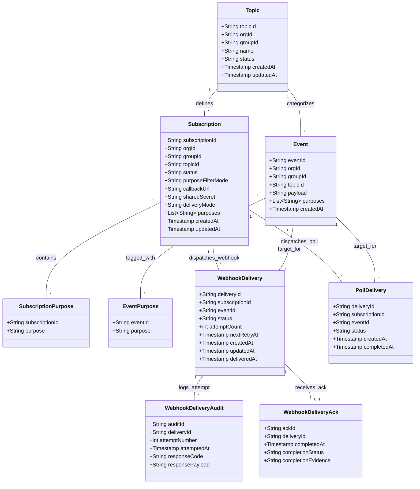
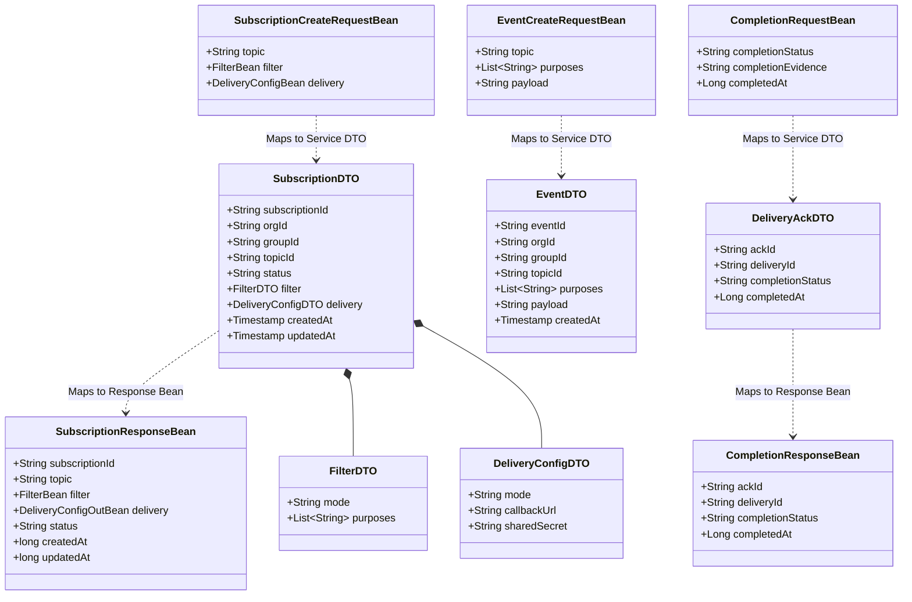
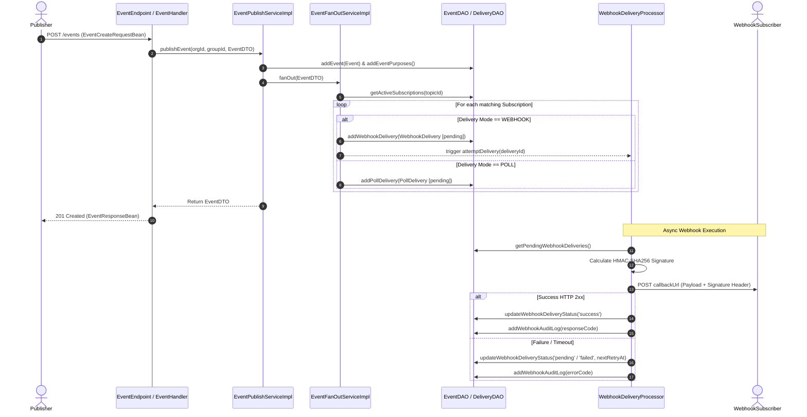

# WSO2 DPDP Event Notification Framework (ENF)
## DTO, DAO & Data Flow Architecture Documentation

---

### Architectural Assessment & Naming Conventions

Based on standard Java/Spring-style conventions and WSO2 project standards, the architecture adopts clear and explicit naming across all layers:

| Area | Assessment | Convention / Rationale |
| :--- | :--- | :--- |
| **DAO Interfaces** | ✅ Good | `TopicDAO`, `SubscriptionDAO`, `EventDAO`, `DeliveryDAO`, `DeliveryAckDAO` |
| **DAO Implementations** | ✅ Good | `TopicDAOImpl`, `SubscriptionDAOImpl`, `EventDAOImpl`, `DeliveryDAOImpl`, `DeliveryAckDAOImpl` |
| **Service DTOs** | ✅ Refined | `TopicDTO`, `SubscriptionDTO`, `FilterDTO`, `DeliveryConfigDTO` *(renamed from DeliveryDTO for clarity)*, `EventDTO`, `PollDeliveryItemDTO`, `PollResponseDTO`, `DeliveryAckDTO` |
| **Request Beans** | ✅ Good | `TopicCreateRequestBean`, `SubscriptionCreateRequestBean`, `EventCreateRequestBean`, `PollRequestBean`, `CompletionRequestBean` |
| **Response Beans** | ✅ Refined | `TopicResponseBean`, `SubscriptionResponseBean`, `EventResponseBean`, `PollResponseBean`, `CompletionResponseBean` *(renamed from CompletionAckBean for clarity)* |
| **Entity Models** | ✅ Good | Singular domain nouns: `Topic`, `Subscription`, `Event`, `WebhookDelivery`, `PollDelivery`, `WebhookDeliveryAudit`, `WebhookDeliveryAck` |
| **Junction Models** | ✅ Good | `SubscriptionPurpose`, `EventPurpose` |
| **Services & Workers** | ✅ Good | `EventPublishServiceImpl`, `EventFanOutServiceImpl`, `WebhookDeliveryProcessor`, `FilterMatcher` |

---

## 1. Architectural Layering

The Event Notification Framework adopts a decoupled 3-tier Java architecture:

```
+-------------------------------------------------------------------------------+
|                             REST ENDPOINT LAYER                               |
|        org.wso2.dpdp.enf.endpoint / org.wso2.dpdp.enf.endpoint.bean           |
|                                                                               |
|  [ REST Endpoints / Handlers ] <---> [ Request / Response Beans (JSON) ]      |
+---------------------------------------+---------------------------------------+
                                        | (Bean <-> DTO Mapping)
                                        v
+-------------------------------------------------------------------------------+
|                                SERVICE LAYER                                  |
|         org.wso2.dpdp.enf.service / org.wso2.dpdp.enf.service.dto             |
|                                                                               |
|  [ Service Interfaces & Impls ] <---> [ Service DTOs (Business Logic) ]      |
|  (Fan-out Matcher, HmacUtil, Delivery Processor, Retry Scheduler)             |
+---------------------------------------+---------------------------------------+
                                        | (DTO <-> DAO Model Mapping)
                                        v
+-------------------------------------------------------------------------------+
|                                  DAO LAYER                                    |
|          org.wso2.dpdp.enf.dao / org.wso2.dpdp.enf.dao.model                   |
|                                                                               |
|  [ DAO Interfaces & Impls ] <---> [ Persistence Entities / Models ]           |
|  (PreparedStatement, JDBC, SQL Queries, Transaction Handling)                 |
+---------------------------------------+---------------------------------------+
                                        | (SQL JDBC)
                                        v
+-------------------------------------------------------------------------------+
|                              PERSISTENCE LAYER                                |
|                                (MySQL Database)                               |
+-------------------------------------------------------------------------------+
```

---

## 2. DAO (Data Access Object) Layer

The DAO layer abstracts and encapsulates all access to the MySQL data store (`enf_db`).

### 2.1 DAO Interfaces & Implementations

| DAO Interface | Implementation Class | Primary Responsibilities | Target DB Tables |
| :--- | :--- | :--- | :--- |
| `TopicDAO` | `TopicDAOImpl` | Create, retrieve, list, update, and delete event topics | `topic` |
| `SubscriptionDAO` | `SubscriptionDAOImpl` | Manage subscriber registrations, purpose filters, callback URLs, and delivery mode configurations | `subscription`, `subscription_purpose` |
| `EventDAO` | `EventDAOImpl` | Store incoming published events and associated purpose tags | `event`, `event_purpose` |
| `DeliveryDAO` | `DeliveryDAOImpl` | Manage pending/completed webhook deliveries, poll queue records, and audit logs | `webhook_delivery`, `poll_delivery`, `webhook_delivery_audit` |
| `DeliveryAckDAO` | `DeliveryAckDAOImpl` | Store delivery completion acknowledgements and signature verification evidence | `webhook_delivery_ack` |

---

### 2.2 DAO Entity Models (`org.wso2.dpdp.enf.dao.model`)

#### 1. `Topic`
Represents an event category registered under an organization and group.
- **Fields**: `topicId`, `orgId`, `groupId`, `name`, `status`, `createdAt`, `updatedAt`

#### 2. `Subscription`
Represents a subscriber's registration to listen to events on a specific topic.
- **Fields**: `subscriptionId`, `orgId`, `groupId`, `topicId`, `status`, `purposeFilterMode` (`ALL` / `EXCEPT`), `callbackUrl`, `sharedSecret`, `deliveryMode` (`WEBHOOK` / `POLL`), `purposes` (List of purpose strings), `createdAt`, `updatedAt`

#### 3. `SubscriptionPurpose`
Junction mapping between a `Subscription` and targeted/excluded purpose identifiers.
- **Fields**: `subscriptionId`, `purpose`

#### 4. `Event`
Represents a published data subject / notification payload.
- **Fields**: `eventId`, `orgId`, `groupId`, `topicId`, `payload`, `purposes` (List of purpose codes), `createdAt`

#### 5. `EventPurpose`
Junction mapping between an `Event` and its purpose codes.
- **Fields**: `eventId`, `purpose`

#### 6. `WebhookDelivery`
Represents an outbound HTTP Webhook delivery dispatch job.
- **Fields**: `deliveryId`, `subscriptionId`, `eventId`, `status` (`pending`, `success`, `failed`), `attemptCount`, `nextRetryAt`, `createdAt`, `updatedAt`, `deliveredAt`

#### 7. `WebhookDeliveryAudit`
Audit trail recording every HTTP attempt made for a webhook delivery job.
- **Fields**: `auditId`, `deliveryId`, `attemptNumber`, `attemptedAt`, `responseCode`, `responsePayload`

#### 8. `PollDelivery`
Queue entry for polling-based delivery mode subscriptions.
- **Fields**: `deliveryId`, `subscriptionId`, `eventId`, `status` (`pending`, `delivered`, `completed`), `createdAt`, `completedAt`

#### 9. `WebhookDeliveryAck`
Acknowledgement record logged upon receiving completion evidence for a webhook delivery.
- **Fields**: `ackId`, `deliveryId`, `completedAt`, `completionStatus` (`success`, `failed`), `completionEvidence`

---

## 3. DTO & Endpoint Bean Layer

DTOs isolate internal database schema representations from business logic and REST API contracts.

### 3.1 Service DTOs (`org.wso2.dpdp.enf.service.dto`)

| Service DTO | Purpose / Description | Wrapped Attributes |
| :--- | :--- | :--- |
| `TopicDTO` | Encapsulates topic details across business service operations | `topicId`, `orgId`, `groupId`, `name`, `status`, `createdAt`, `updatedAt` |
| `SubscriptionDTO` | Encapsulates subscription details, delivery configs, and purpose filters | `subscriptionId`, `orgId`, `groupId`, `topicId`, `status`, `filter` (`FilterDTO`), `delivery` (`DeliveryConfigDTO`), `createdAt`, `updatedAt` |
| `FilterDTO` | Business DTO for subscription purpose filtering | `mode` (`ALL` / `EXCEPT`), `purposes` (List of purpose strings) |
| `DeliveryConfigDTO` | Business DTO for subscription delivery channel configuration | `mode` (`WEBHOOK` / `POLL`), `callbackUrl`, `sharedSecret` |
| `EventDTO` | Encapsulates published event details and payload | `eventId`, `orgId`, `groupId`, `topicId`, `purposes`, `payload`, `createdAt` |
| `PollDeliveryItemDTO` | Represents a single event item retrieved during a subscriber long-poll | `deliveryId`, `eventId`, `topic`, `payload`, `publishedAt` |
| `PollResponseDTO` | Encapsulates poll response collection | `deliveries` (List of `PollDeliveryItemDTO`) |
| `DeliveryAckDTO` | Encapsulates completion submission result / acknowledgement | `ackId`, `deliveryId`, `completionStatus`, `completedAt` |

---

### 3.2 Endpoint Request & Response Beans (`org.wso2.dpdp.enf.endpoint.bean`)

| Bean Class | Type | Description |
| :--- | :--- | :--- |
| `TopicCreateRequestBean` | Request | Payload for POST `/topics` |
| `TopicResponseBean` | Response | Body for single topic API responses |
| `TopicListResponseBean` | Response | Paginated/listed topics wrapper |
| `SubscriptionCreateRequestBean` | Request | Payload for POST `/subscriptions` |
| `SubscriptionResponseBean` | Response | Body for subscription API responses |
| `SubscriptionListResponseBean` | Response | Listed subscriptions wrapper |
| `FilterBean` | Component | JSON representation of filter options |
| `DeliveryConfigBean` | Component | JSON input for delivery channel configuration |
| `DeliveryConfigOutBean` | Component | JSON output for delivery channel config (masks secret) |
| `EventCreateRequestBean` | Request | Payload for POST `/events` (Event publishing) |
| `EventResponseBean` | Response | Body returned upon successful event publishing |
| `PollRequestBean` | Request | Payload for POST `/poll` |
| `PollResponseBean` | Response | Body returned for long-polling requests |
| `PollDeliveryItemBean` | Component | Single event item in poll response |
| `CompletionRequestBean` | Request | Payload for POST `/deliveries/{deliveryId}/completion` |
| `CompletionResponseBean` | Response | Response returned for completion submissions |

---

## 4. Layer-to-Layer Data Mapping Matrix

| Endpoint Bean | Service DTO | DAO Model / Entity | Database Table |
| :--- | :--- | :--- | :--- |
| `TopicCreateRequestBean` / `TopicResponseBean` | `TopicDTO` | `Topic` | `topic` |
| `SubscriptionCreateRequestBean` / `SubscriptionResponseBean` | `SubscriptionDTO` (embeds `FilterDTO` & `DeliveryConfigDTO`) | `Subscription` + `SubscriptionPurpose` | `subscription`, `subscription_purpose` |
| `EventCreateRequestBean` / `EventResponseBean` | `EventDTO` | `Event` + `EventPurpose` | `event`, `event_purpose` |
| N/A (Internal Retry/Dispatch) | N/A | `WebhookDelivery`, `WebhookDeliveryAudit` | `webhook_delivery`, `webhook_delivery_audit` |
| `PollRequestBean` / `PollResponseBean` | `PollDeliveryItemDTO`, `PollResponseDTO` | `PollDelivery` | `poll_delivery` |
| `CompletionRequestBean` / `CompletionResponseBean` | `DeliveryAckDTO` | `WebhookDeliveryAck` | `webhook_delivery_ack` |

---

## 5. End-to-End Data Relationship & Flow Pipelines

### Flow Pipeline: Completion Submission vs Acknowledgement Record

```
CompletionRequestBean  (Endpoint Request)
        |
        v
CompletionHandler / CompletionEndpoint
        |
        v
CompletionServiceImpl
        |
        v
DeliveryAckDTO  (Service DTO)
        |
        v
WebhookDeliveryAck  (DAO Model)
        |
        v
webhook_delivery_ack  (MySQL Database Table)
```

---

## 6. Mermaid Visual Diagrams

### 6.1 Entity Relationship (ER) / DAO Class Diagram



---

### 6.2 DTO and Endpoint Bean Class Mapping Diagram



---

### 6.3 Comprehensive Data Flow Architecture Sequence



---

### Summary of Documented Artifacts

- **File Path**: [DTO_DAO_DOCUMENTATION.md](file:///Users/Thiwanka/dpdp-solution/event-notification/DTO_DAO_DOCUMENTATION.md)
- **DAO Models**: 9 entities (`Topic`, `Subscription`, `SubscriptionPurpose`, `Event`, `EventPurpose`, `WebhookDelivery`, `WebhookDeliveryAudit`, `PollDelivery`, `WebhookDeliveryAck`).
- **DAOs**: 5 interfaces & implementations (`TopicDAO`, `SubscriptionDAO`, `EventDAO`, `DeliveryDAO`, `DeliveryAckDAO`).
- **Service DTOs**: 8 DTO classes (`DeliveryConfigDTO`, `SubscriptionDTO`, `FilterDTO`, `EventDTO`, `PollDeliveryItemDTO`, `PollResponseDTO`, `DeliveryAckDTO`, `TopicDTO`).
- **Endpoint Beans**: 17 request/response beans including `CompletionResponseBean`.
